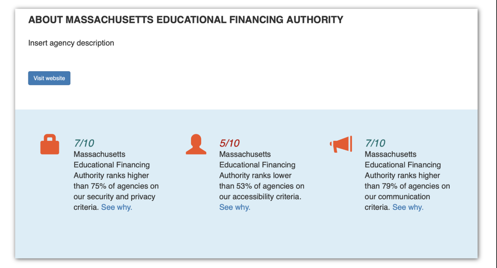

# GovLens

## About the project

GovLens is a government transparency project developed by MuckRock and Code for Boston engineers. Our mission is to create a more open, accessible, and secure democracy through examining the technical elements of government agency websites. We use algorithms to score thousands of federal and state agencies based on their transparency, security, privacy, and accessibility. We then publish our findings and help communicate to government agencies possible improvements to their infrastructures that would better the agency as a whole.



## Why?

We get reminders all the time of how well our physical civic infrastructure is doing: Did my car hit a pothole? Are the swing sets covered in rust? It can be harder to see how well our digital civic infrastructure is holding up, however, particularly when it comes to the parts of the web that can be invisible to many people: How accessible is a site to people who rely on screen readers or who have reduced vision? Which third-party trackers have access to visitor data, and how is that data being guarded? Are government websites following basic best practices in utilizing secure connections?

While we have a [National Bridge Inventory](https://www.fhwa.dot.gov/bridge/nbi.cfm) that monitors dangerous bridges and other federal agencies that monitor other core infrastructure issues, we do not have similar insights into how strong or weak much of our digital infrastructure is. 

GovLens helps to provide at least the start of an answer to that, by making those oftentimes overlooked aspects of digital infrastructure more visible via public report cards for each agency in our database as well as collated data for each jurisdiction and state, letting us see which areas of the country are leading the way and which might need a little more prodding.

This is partially inspired by the work of Pulse.CIO.Gov, an official federal government website that monitored the adoption of HTTPS compliance among federal websites, as well as [SecureThe.News](https://securethe.news), which did the same thing for news websites. Both of these projects brought wider visibility to the issue and provided natural and effective peer pressure for website operators to improve. Our hope is we can do the same for local government, while also compiling a rich research data set for future analysis.

## Who is this site for?
This site has three core planned audiences:

* __The general public__, so that they’re better educated about the state of government digital infrastructure and why it matters.
* __Government decision makers__, so that they can understand why they need to invest in better adhering to web standards as well as see where their sites stand compared to their peers.
* __Local and national media outlets__, so as best to reach and influence the above categories.


## Getting started basics

- [ ] Make sure [you've registered for the Code for Boston Slack](https://communityinviter.com/apps/cfb-public/code-for-boston-slack-invite).
- [ ] Join the #MuckRock channel on Slack.
- [ ] Ask a current member to be added to our Github organization ([They'll need to click here](https://github.com/codeforboston/GovLens/settings/collaboration)). After they've sent you an invite, you'll need to either check your email or notifications in Github (the alarm icon on the top right of your Github page) to accept the invite.
- [ ] If you're interested in working on the backend of the site, [try following the instructions](#installation-instructions)

## Project goals

The goal is to create an automatically updated database that tracks, over time, how well government agencies websites at the state, local, and federal levels follow best practices when it comes to HTTPS security, mobile friendliness, reader accessibility, and other key areas.

Over time, we hope to show whether both individual agencies are improving or worsening, as well as help highlight national shifts along the metrics we monitor. Individual pages show the most recent snapshot ranking, but our API will make historical data available.

## Current status

The project is currently in testing stages, as we work to both develop usable, accurate data and build a pipeline for regularly populating it. The site currently can run locally, but several of the data categories are filled with randomized testing data and any report cards generated are for **demonstration purposes only**. These scores do not represent actual scores for agencies.

## Installation instructions

Install python3 if you haven't installed it yet. 
```bash
python3 --version
```
If you do not see a version you will need to visit [Python](https://www.python.org/downloads/) or google how to install it for your operating system.  You want python3 as well as pip3.


Create a developer account on Github if you don't have one: [Github](https://github.com/)

Fork the repository on Github, see: [Fork a Repo](https://help.github.com/en/github/getting-started-with-github/fork-a-repo)

Clone your forked repository from the command line (this will create a GovLens directory):
```bash
git clone https://github.com/--your-github-name--/GovLens.git
```

Navigate to the base directory of the reposistory and prepare to install depedencies.

To start, it is recommend to create a
[virtual environment](https://virtualenv.pypa.io/en/stable/userguide/). If you have not
used `virtualenv` before, install it with: `pip3 install virtualenv`.

```bash
# Create a virtual environment to manage dependencies
virtualenv venv
source venv/bin/activate
```

Now install the dependencies with pip:

```bash
# Install requirements.txt
pip3 install -r requirements.txt
```

After the dependencies have installed, we want to prepare the database.

```bash
# Perform data migrations
python3 manage.py migrate
```

Then, we need to import a CSV file containing existing agency information. Start by
running a Django shell:

```bash
python3 manage.py shell

# From within the shell
>>> from apps.civic_pulse.utils.load_models import *
>>> fill_agency_objects()
>>> exit()
```

The following steps are needed in order to connect the api with the scrapers. If you do not wish to do that, then this may be skipped. We need to create a dummy user for the scraper to be able to access the api. The api is part of the Django projet. 
Note: The scrapers live in an independent environment not neccessarily in the same server as the Django website. The scrapers read and write data to the website using api endpoints. 

- create an admin user to be able to login to the admin portal of the website: <site-name>/admin

```bash
  python3 manage.py createsuperuser --username admin --email admin@admin.com
  
  # enter the password when prompted. It can be any password that you wish to use. 
  # It is used for login to the admin website.
 ```
- Start up the webserver so we can create a user for the scraper.
```bash
python3 manage.py runserver
```
- Visit localhost:8000/admin and follow the UI to add a new user named "scraper", set the password to whatever you would like but make note of it.

- In a new terminal tab, create a token for the scraper user using the following command
```bash
python3 manage.py drf_create_token scraper
```
Finally, the database is ready to go! We are now ready to run the server:

Navigate in your browser to `http://127.0.0.1:8000/` and you should see a list of
agencies.
